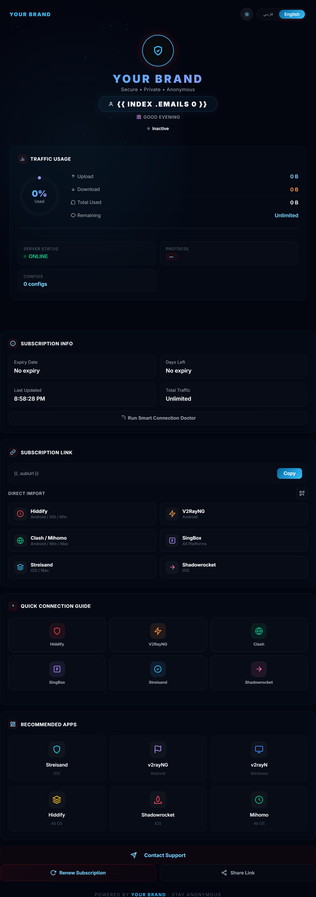
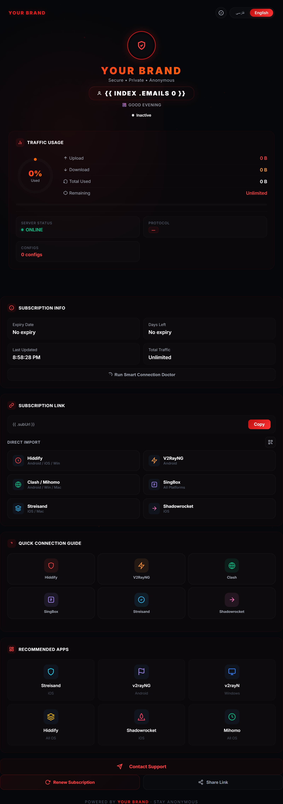
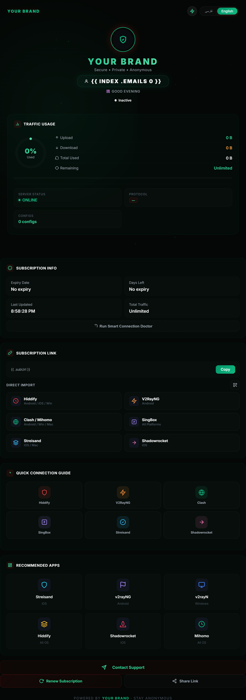

<div align="center">

<br/>

# 👻 Ghost Sub
### Premium Subscription Page Template for 3X-UI

<br/>

[](LICENSE)
[](https://github.com/MHSanaei/3x-ui)
[](.)
[](.)

<br/>

> یه کامند. اسم برندت. کانالت. تموم.
>
> One command. Your brand. Your channel. Done.

<br/>

</div>

---

## 📸 Preview

<!-- Add screenshots here -->
<div align="center">


<br/><br/>

</div>

---

## ✨ این چیه؟

یه **صفحه سابسکریپشن سفارشی** برای پنل‌های [3X-UI](https://github.com/MHSanaei/3x-ui).

به جای صفحه ساده و پیش‌فرض، کاربرات یه **UI شیشه‌ای تاریک** می‌بینن که کاملاً با اسم و کانال خودت برند شده — با یه دستور نصب.

---

## 🎨 امکانات

| امکان | توضیح |
|---|---|
| 🎨 **۳ تم رنگی** | قرمز · سبز · آبی-بنفش — کاربر می‌تونه عوض کنه |
| 🌐 **دوزبانه** | فارسی (RTL) + انگلیسی، اتوماتیک تشخیص داده میشه |
| 📊 **نمودار ترافیک** | حلقه انیمیشن‌دار آپلود / دانلود / باقیمانده |
| ⏳ **تایمر زنده** | ثانیه شمار تا انقضای اشتراک |
| 📋 **لیست کانفیگ** | فیلتر بر اساس پروتکل: VLESS · VMess · Trojan · SS |
| 📲 **ایمپورت مستقیم** | یه کلیک برای Hiddify · Clash · SingBox · V2RayNG · Streisand · Shadowrocket |
| 🔗 **کد QR** | بارکد اشتراک قابل اسکن |
| 🩺 **دکتر اتصال** | راهنمای هوشمند عیب‌یابی برای کاربرا |
| 🌌 **پس‌زمینه ذرات** | انیمیشن پارتیکل با خطوط اتصال |
| 📡 **دکمه پشتیبانی** | لینک مستقیم به کانال تلگرام شما |
| 🏷️ **برند کامل** | اسم + کانالت خودکار توسط اسکریپت جایگذاری میشه |

---

## ⚡ نصب — یه دستور

با دسترسی **root** روی سرور:

```bash
bash <(curl -fsSL https://raw.githubusercontent.com/YASIN0ASADI/ghost-sub/main/install.sh)
```

اسکریپت **دو سوال** ازت می‌پرسه:

1. 📛 اسم برند / سرویست
2. 📣 یوزرنیم کانال تلگرامت

بعد خودش:
- تمپلت رو دانلود می‌کنه
- برند رو جایگذاری می‌کنه
- پوشه `/etc/3x-ui/sub_templates/my-theme/` می‌سازه
- فایل `index.html` رو اونجا نصب می‌کنه
- سرویس x-ui رو ریستارت می‌کنه

> ✅ نیاز به ویرایش دستی نیست. همه چیز خودکاره.

---

## 🎛️ فعال‌سازی در پنل 3X-UI

بعد از اجرای اسکریپت، برو داخل **پنل ادمین 3X-UI**:

```
تنظیمات پنل ← Subscription ← Subscription Template Path
```

این مسیر رو وارد کن:

```
/etc/3x-ui/sub_templates/my-theme/
```

ذخیره کن — تموم شد ✅

---

## 🗂️ نصب دستی (روش جایگزین)

```bash
git clone https://github.com/YASIN0ASADI/ghost-sub.git
cd ghost-sub
chmod +x install.sh
sudo bash install.sh
```

---

## 🔧 چی جایگذاری میشه؟

| placeholder در تمپلت | جایگزین میشه با |
|---|---|
| `YOUR BRAND` | اسم برندت (بزرگ) |
| `@yourchannel` | یوزرنیم تلگرامت |
| `https://t.me/yourchannel` | لینک تلگرامت |

---

## 📁 ساختار ریپو

```
ghost-sub/
├── sub.html        ← تمپلت اصلی (placeholder برند)
├── install.sh      ← اسکریپت نصب خودکار
└── README.md       ← همین فایل
```

---

## ❓ سوالات متداول

**سوال: با همه نسخه‌های 3X-UI کار می‌کنه؟**  
جواب: بله، با همه نسخه‌های اخیر که از custom template پشتیبانی می‌کنن.

**سوال: روی چند سرور می‌تونم نصب کنم؟**  
جواب: بله. دستور رو روی هر سرور اجرا کن و اطلاعات برندت رو بده.

**سوال: می‌تونم رنگ‌ها رو بیشتر سفارشی کنم؟**  
جواب: بله. بعد از نصب، فایل `/etc/3x-ui/sub_templates/my-theme/index.html` رو مستقیم ویرایش کن.

**سوال: سرویس خودکار ریستارت نشد چیکار کنم؟**  
جواب: دستی اجرا کن: `systemctl restart x-ui`

---

## 🤝 کردیت و لایسنس

طراحی و ساخت توسط [@YASIN0ASADI](https://github.com/YASIN0ASADI)

لایسنس [MIT](LICENSE) — استفاده، فورک و سفارشی‌سازی آزاده.  
اگه مفید بود، یه ⭐ بزن ممنون میشم!

---

<div align="center">

**ساخته شده با ❤️ برای جامعه VPN ایران**

</div>
