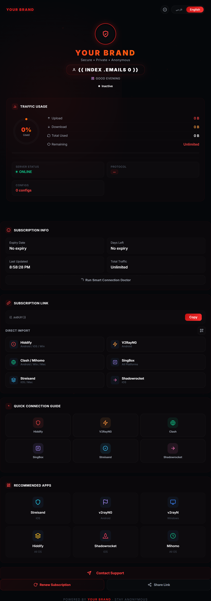
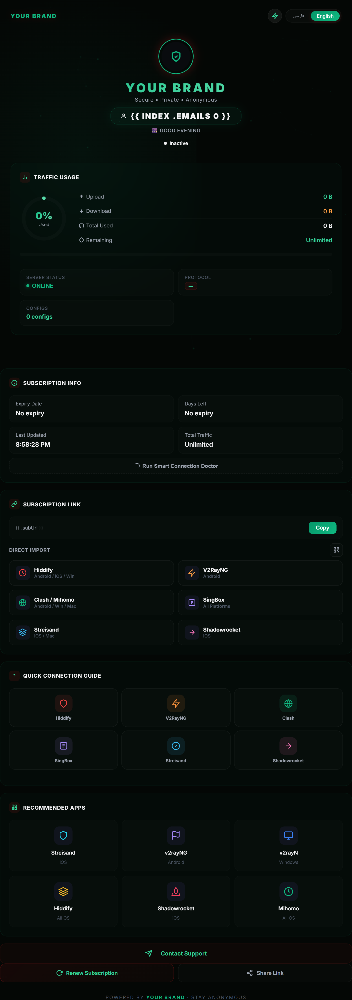
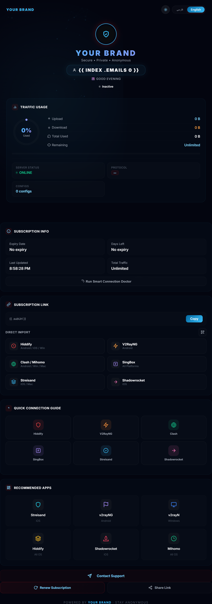

<div align="center">

# 👻 Ghost Sub

### Premium Subscription Page Template

#### Compatible with 3X-UI · Pasarguard · Marzban

[](LICENSE)
[](https://github.com/MHSanaei/3x-ui)
[](https://github.com/PasarGuard/panel)
[](https://github.com/Gozargah/Marzban)
[](.)

> یه کامند. پنلت. تمت. اسم برندت. تموم.
>
> One command. Your panel. Your theme. Your brand. Done.

</div>

---

## 📸 Preview

| Red | Green | Blue/Purple |
|-----|-------|-------------|
|  |  |  |

---

## ✨ امکانات

| امکان | توضیح |
|-------|-------|
| 🎨 **۳ تم رنگی** | قرمز · سبز · آبی-بنفش — انتخاب موقع نصب + تغییر توسط کاربر |
| 🌐 **دوزبانه** | فارسی (RTL) + انگلیسی، تشخیص خودکار زبان مرورگر |
| 📅 **تاریخ شمسی** | نمایش تاریخ انقضا به شمسی در کنار تاریخ میلادی (حالت فارسی) |
| 📊 **نمودار ترافیک** | حلقه انیمیشن‌دار با counter زنده از ۰ تا مقدار واقعی |
| 📈 **نمودار مصرف واقعی** *(Pasarguard/Marzban)* | نمودار ستونی و خطیِ تعاملی برای ۱ روز تا ۱ ماه، با لمس/کشیدن روی نقاط برای دیدن مقدار دقیق — نیازمند سرویس Usage Tracker |
| ⏳ **تایمر زنده** | ثانیه‌شمار تا انقضا |
| ⚠️ **هشدار خودکار** | بنر انقضا · بنر ۳ روز مانده · بنر حجم کم (دو سطح ۲۰٪ و ۱۰٪) |
| 🔍 **جستجو در کانفیگ‌ها** | فیلتر بر اساس نام و پروتکل |
| 📋 **لیست کانفیگ** | فیلتر پروتکل + کپی با تیک سبز برای هر کانفیگ و کپی همه + QR اختصاصی هر کانفیگ |
| 📖 **اپلیکیشن‌ها و اتصال** | راهنمای گام‌به‌گام هر اپ (Hiddify، V2RayNG، Clash، SingBox، Streisand، Shadowrocket) با دکمه‌ی دانلود و افزودن مستقیم |
| 📷 **QR Code** | بارکد اختصاصی برای لینک اشتراک و هر کانفیگ |
| ✅ **فیدبک کپی** | تیک سبز روی دکمه کپی کانفیگ و کپی همه |
| 🔊 **کنترل صدا** | toggle خاموش/روشن صدای کلیک |
| ⏰ **زمان نسبی** | آخرین اتصال به صورت "۵ دقیقه پیش" با آپدیت خودکار |
| 📱 **PWA** | قابل نصب روی گوشی مثل اپ بدون نیاز به Store |
| 💫 **انیمیشن‌ها** | shimmer لودینگ · card entrance · ring counter |
| 🌌 **پس‌زمینه ذرات** | انیمیشن پارتیکل با خطوط اتصال |

---

## ⚡ نصب — یه دستور

```bash
bash <(curl -fsSL https://raw.githubusercontent.com/YASIN0ASADI/ghost-sub/main/install.sh)
```

اسکریپت **سه سوال** ازت می‌پرسه:

1. 🖥️ پنل: **3X-UI** یا **Pasarguard** یا **Marzban**
2. 🎨 تم پیش‌فرض: **Red** یا **Green** یا **Blue/Purple**
3. 📛 اسم برند / سرویست

اگه پنلت **Pasarguard** یا **Marzban** باشه، یه سوال اختیاری هم اضافه میشه: نصب **Usage Tracker** برای نمودار مصرف واقعی (توضیح کامل پایین‌تر).

> ✅ نیاز به ویرایش دستی نیست. همه چیز خودکاره.

---

## 🎨 تم‌ها

کاربر می‌تونه **توی صفحه** با زدن دکمه تم، بین سه رنگ جابجا بشه.
تم پیش‌فرض موقع نصب انتخاب میشه.

---

## 📈 Usage Tracker — نمودار مصرف واقعی (Pasarguard / Marzban)

پنل‌ها به‌صورت پیش‌فرض تاریخچه‌ی مصرف نگه نمی‌دارن، فقط عدد لحظه‌ای میدن. برای داشتن نمودار واقعی (نه تقریبی)، یه سرویس کوچیک به اسم **Usage Tracker** هست که:

- هر ۱۵ دقیقه با API پنل صحبت می‌کنه و مصرف هر کاربر رو می‌خونه
- یه فایل سبک کنار صفحه‌ی ساب هر کاربر ذخیره می‌کنه
- صفحه‌ی ساب این فایل رو می‌خونه و نمودار رو می‌کشه

موقع نصب (یا آپدیت) اگه پنلت Pasarguard یا Marzban باشه، ازت می‌پرسه که این سرویس نصب بشه یا نه. اگه بله زدی، فقط یه‌بار آدرس پنل و اطلاعات ادمین رو می‌پرسه — **در آپدیت‌های بعدی دیگه چیزی پرسیده نمیشه**، فقط می‌پرسه آپدیتش کنه یا نه.

بدون این سرویس هم نمودار کار می‌کنه، منتها بر پایه‌ی `localStorage` مرورگر (فقط زمان‌هایی که کاربر خودش صفحه رو باز کرده).

---

## 🎛️ فعال‌سازی

### 3X-UI
بعد از نصب → **پنل ادمین → Settings → Subscription → Sub Theme Directory**:
```
/etc/3x-ui/sub_templates/my-theme/
```

### Pasarguard
مطمئن شو این دو خط توی `/opt/pasarguard/.env` هست:
```
CUSTOM_TEMPLATES_DIRECTORY="/var/lib/pasarguard/templates/"
SUBSCRIPTION_PAGE_TEMPLATE="subscription/index.html"
```
بعد توی پنل: **Subscription Settings → Disable Subscription Template → OFF**
```bash
pasarguard restart
```

### Marzban
مطمئن شو این دو خط توی `/opt/marzban/.env` هست:
```
CUSTOM_TEMPLATES_DIRECTORY="/var/lib/marzban/templates/"
SUBSCRIPTION_PAGE_TEMPLATE="subscription/index.html"
```
```bash
systemctl restart marzban
```

---

## 🔧 چی جایگذاری میشه؟

| placeholder | جایگزین میشه با |
|-------------|----------------|
| `YOUR BRAND` | اسم برندت (بزرگ) |

---

## 📁 ساختار فایل‌ها

```
ghost-sub/
├── sub.html          ← نسخه 3X-UI
├── pasarguard.html   ← نسخه Pasarguard
├── marzban.html      ← نسخه Marzban
├── install.sh        ← اسکریپت نصب
├── manifest.json     ← فایل PWA
├── tracker/           ← سرویس Usage Tracker
│   ├── tracker.py
│   └── ghost-tracker.service
└── screenshots/      ← تصاویر پیش‌نمایش
```

---

## 🤝 کردیت و لایسنس

طراحی و ساخت توسط [@YASIN0ASADI](https://github.com/YASIN0ASADI)

TELEGRAM: https://t.me/Inv1n3ible

لایسنس [MIT](LICENSE) — استفاده، فورک و سفارشی‌سازی آزاده.
اگه مفید بود، یه ⭐ بزن ممنون میشم!


## ‌                    ساخته شده با ❤️ برای جامعه VPN ایران
